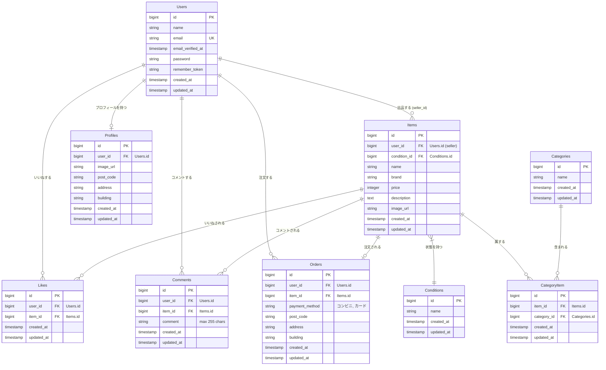

```mermaid
erDiagram
Users ||--o{ Items : "出品する (seller_id)"
Users ||--o{ Likes : "いいねする"
Users ||--o{ Comments : "コメントする"
Users ||--o{ Orders : "注文する"
Users ||--o| Profiles : "プロフィールを持つ"

    Items ||--o{ Likes : "いいねされる"
    Items ||--o{ Comments : "コメントされる"
    Items ||--o| Orders : "注文される"
    Items }|--|| Conditions : "状態を持つ"

    Items ||--o{ CategoryItem : "属する"
    Categories ||--o{ CategoryItem : "含まれる"

    Users {
        bigint id PK
        string name
        string email UK
        timestamp email_verified_at
        string password
        string remember_token
        timestamp created_at
        timestamp updated_at
    }

    Profiles {
        bigint id PK
        bigint user_id FK "Users.id"
        string image_url
        string post_code
        string address
        string building
        timestamp created_at
        timestamp updated_at
    }

    Items {
        bigint id PK
        bigint user_id FK "Users.id (seller)"
        bigint condition_id FK "Conditions.id"
        string name
        string brand
        integer price
        text description
        string image_url
        timestamp created_at
        timestamp updated_at
    }

    Categories {
        bigint id PK
        string name
        timestamp created_at
        timestamp updated_at
    }

    CategoryItem {
        bigint id PK
        bigint item_id FK "Items.id"
        bigint category_id FK "Categories.id"
        timestamp created_at
        timestamp updated_at
    }

    Conditions {
        bigint id PK
        string name
        timestamp created_at
        timestamp updated_at
    }

    Likes {
        bigint id PK
        bigint user_id FK "Users.id"
        bigint item_id FK "Items.id"
        timestamp created_at
        timestamp updated_at
    }

    Comments {
        bigint id PK
        bigint user_id FK "Users.id"
        bigint item_id FK "Items.id"
        string comment "max 255 chars"
        timestamp created_at
        timestamp updated_at
    }

    Orders {
        bigint id PK
        bigint user_id FK "Users.id"
        bigint item_id FK "Items.id"
        string payment_method "コンビニ, カード"
        string post_code
        string address
        string building
        timestamp created_at
        timestamp updated_at
    }
```