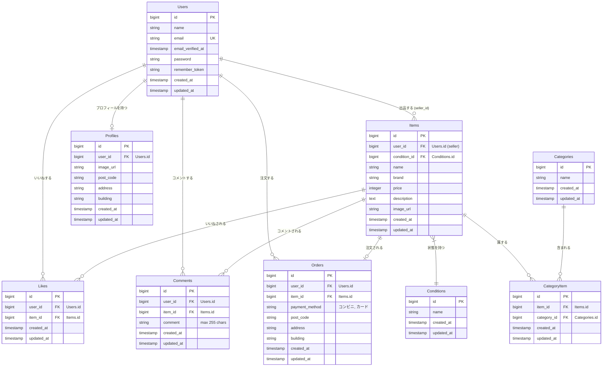

# coachtechフリマ

## プロジェクト概要

このプロジェクトは、アイテムの出品と購入を行うための独自のフリマアプリです。
10代から30代の社会人をターゲットとし、シンプルな操作で商品の売買ができるプラットフォームを提供します。

### 主な機能

- **ユーザー認証**: 会員登録、ログイン、ログアウト（Fortify）
- **商品一覧・検索**: 全商品の一覧表示、商品名による部分一致検索
- **商品詳細**: 商品情報（画像、価格、説明等）の確認、いいね、コメント投稿
- **出品**: 商品画像のアップロード、カテゴリ（複数選択可）、状態設定、価格設定
- **プロフィール**: プロフィール画像、ユーザー名、住所設定、出品/購入履歴の確認

## 開発環境

アプリの起動後、以下のURLからローカル環境にアクセスできます。

- **開発環境（トップページ）**: [http://localhost/](http://localhost/)
- **phpMyAdmin（DB管理）**: [http://localhost:8080/](http://localhost:8080/)

- **Framework**: Laravel 8.75
- **PHP**: 8.1
- **Database**: MySQL 8.0.26
- **Web Server**: Nginx 1.21.1
- **Others**:
  - Laravel  Fortify (認証)
  - phpMyAdmin (DB管理ツール: ポート 8080)

## 主要URL・ルート一覧

| アクセス権 | URL（パス） | ルート名 | 対応機能 |
| :--- | :--- | :--- | :--- |
| **ゲスト可** | `/` | `items.index` | 商品一覧画面（トップページ） |
| | `/item/{id}` | `items.show` | 商品詳細画面 |
| **要認証** | `/mypage` | `mypage` | マイページ（プロフィール・履歴） |
| | `/mypage/profile` | `profile.edit` / `update` | プロフィール編集画面・更新処理 |
| | `/sell` | `items.create` / `store` | 商品出品画面・出品処理 |
| | `/purchase/{item_id}` | `purchase.create` / `store` | 商品購入画面・決済処理（Stripe） |
| | `/purchase/address/{item_id}` | `purchase.address` / `update` | お届け先住所変更画面・更新処理 |
| | `/item/{item_id}/like` | `items.like` | いいね登録・解除（トグル処理） |
| | `/item/{item_id}/comment` | `items.comment` | コメント投稿処理 |


## データベース設計（ER図）

GitHub等では、以下のMermaidコードが自動的にグラフィカルなER図としてレンダリングされます。



## セットアップ手順（ターミナル操作）

### 1. リポジトリのクローン

このプロジェクトは、以下のテンプレートリポジトリからクローンして作成しています。

```bash
git clone git@github.com:Estra-Coachtech/laravel-docker-template.git
cd coachtech-frima
```

### 2. 環境設定ファイルの準備

```bash
cp src/.env.example src/.env
```

### 3. Dockerコンテナの起動

```bash
docker-compose up -d --build
```

### 4. アプリケーションの初期化

```bash
# ライブラリのインストール
docker-compose exec php composer install

# アプリケーションキーの生成
docker-compose exec php php artisan key:generate

# ストレージのシンボリックリンク作成
docker-compose exec php php artisan storage:link
```

### 5. データベースの構築

```bash
# マイグレーションの実行
docker-compose exec php php artisan migrate

# 初期データ（シーダー）の投入
docker-compose exec php php artisan db:seed
```

## ディレクトリ構造

主要なディレクトリの構成は以下の通りです。

```text
.
├── docker/              # Docker環境設定（PHP, Nginx, MySQL等）
├── src/                 # Laravelアプリケーション本体
│   ├── app/             # コントローラーやモデル（主要プログラム）
│   ├── database/        # マイグレーション・シーダー（DB設計）
│   ├── resources/       # Views（Blade画面ファイル）
│   └── routes/          # web.php（ルーティング設定）
└── docker-compose.yml   # Docker Compose構成ファイル
```

## メール認証機能（要確認）

本プロジェクトでは、一部のルートへのアクセスに**メール認証（Verified）**を必須としています。

### 開発環境での認証手順

ローカル環境では、実際にメールは送信されず、送信されるはずのメール内容がすべてログファイルに書き出されます。

1. 新規ユーザー登録（またはログイン）を行う。
2. 認証が必要なページ（マイページや出品画面など）にアクセスすると、メール確認画面が表示されます。
3. プロジェクトのログファイルを開きます。
   - ログの場所: `src/storage/logs/laravel.log`
4. ログの最下部付近に出力されている **[Verify Email Address]** というリンク（URL）を探します。
5. そのURLをコピーし、開発中のブラウザの別タブ等に貼り付けてアクセスします。
6. 認証が完了し、各機能が利用可能になります。

> **Note**  
> もしメールがログに出力されない場合は、`.env` ファイルの `MAIL_MAILER` 設定が `log` になっているか確認してください。
> ```env
> MAIL_MAILER=log
> ```